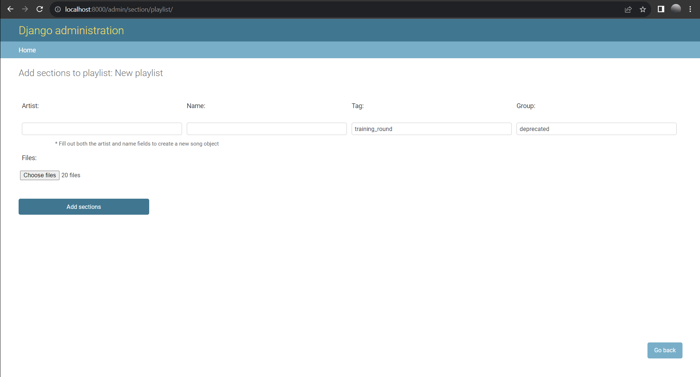
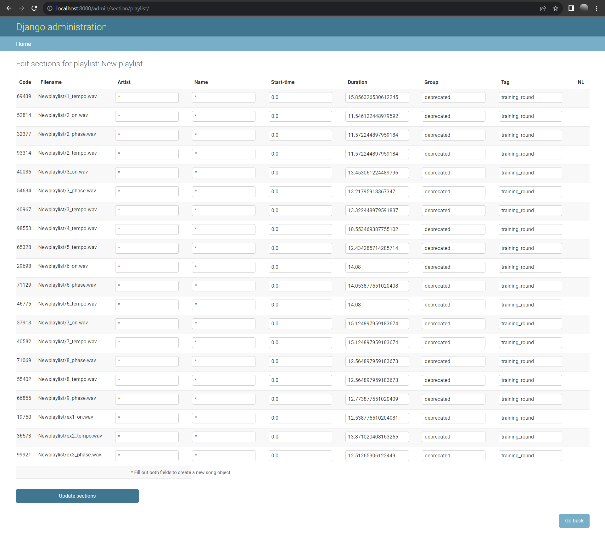

# Creating playlists

## Creating a playlist

A playlist contains all the sound files used in an experiment, stored as `Section` objects. 
The attributes of these sections can be edited in the admin interface or processed from a CSV file.
These attributes can be used in your rules file to distinguish your sections for different purposes.

Each time the playlist is saved with `Process csv` checked, the sections are updated with the attributes from the `Csv` field.

#### CSV Format (comma separated):
`artist_name [string], song_name [string], start_position [float], duration [float], "path/filename.mp3" [string], tag [string], group [string]`

## Uploading sound files
### Uploading Sound files through the admin interface:

- Click `Add playlist` at `localhost:8000/admin/section/playlist/` 

- Give your playlist a name. Note that this name will also be used to name the folder where the sound files will be stored on the server, so make sure this name is unique.
- Leave the `Csv` field empty, `Process Csv` unchecked and click `SAVE`. Your playlist will now appear in the list when you click on "Playlists" on the left.

- Click `Add sections` next to your playlist.

-  You can add some attributes for your sections now, or leave these blank.
  -  When either the `Artist` or the `Name` field is filled a `Song` object will be created for these sections.
  -  The `Tag` and `Group` attributes can be used as identifiers in your rules file.
  -  Click `Choose files` to select which audio files (.mp3, .wav, .aiff, .flac and .ogg currently supported) should be uploaded and associated with this metadata.

- Click `Add sections` to upload your files to the server and add the sections to the database.

Click on the name of your new playlist and notice that the `Csv` field is now filled with the attributes of the sections and the metadata of its sounds.

### Manually uploading sound files

When running a local MUSCLE development installation you can just create a folder with your sound files at `backend/upload/`

Running a production server you can use SSH or FTP to upload your sound files to a server, then adjust your apache / ngnx config to point to the location from which the sound files will be served.

#### Generate a CSV file:

- Run the `compileplaylist` command on your server container: `docker-compose run --rm server ./manage.py compileplaylist <path-relative-to-upload-folder>`. Optionally, you can pass arguments to set fields in the csv, pass the flag `--help` to see the options. The command will create a file named `audiofiles.csv` in the folder of your sound files.
- Click `Add playlist` at `localhost:8000/admin/section/playlist/`
- Give your playlist a name
- Paste the (edited) content of `audiofiles.csv` into the csv field.
- Check `Process Csv` and click `SAVE`

This will create `section` objects for your sound files with the attributes from the CSV file.

## Editing the section attributes

### Through the admin interface
- Click `Edit sections` at `http://localhost:8000/admin/section/playlist/`

- Now you can alter the information of the sections in a table:

### Through the `Csv` field:
- Copy the `Csv` field of your playlist in your CSV editor and make the necessary changes.
- Paste the content of your CSV file back into the `Csv` field of your playlist.
- Check `Process csv` and click `SAVE`
