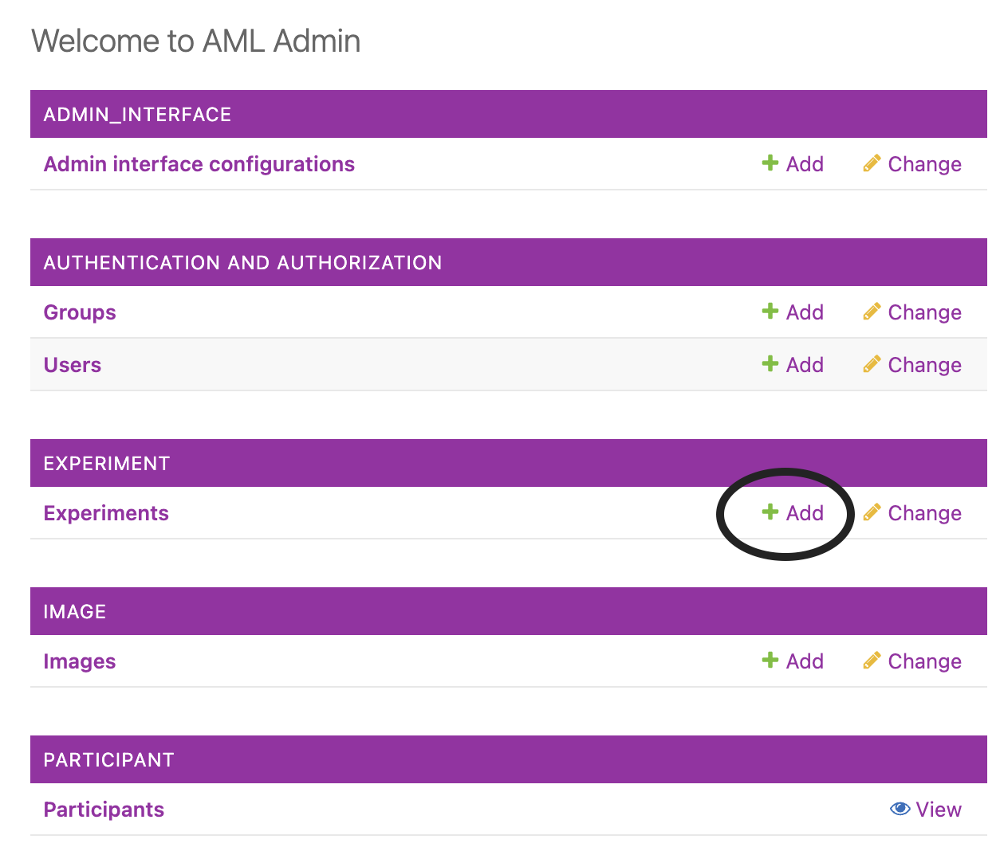
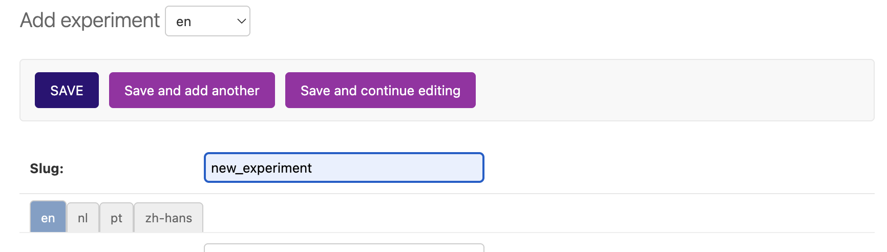
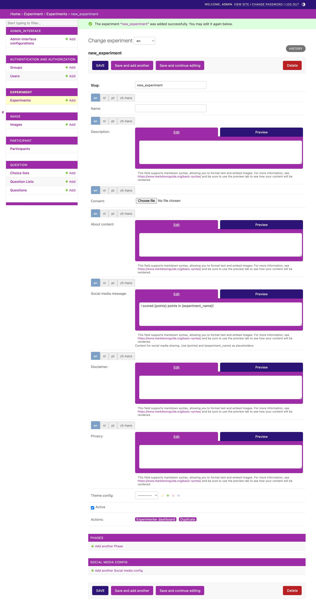
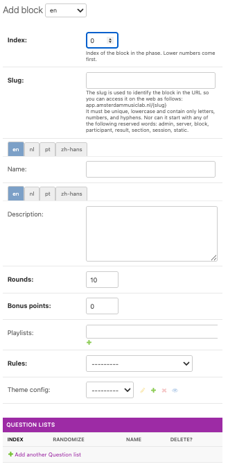
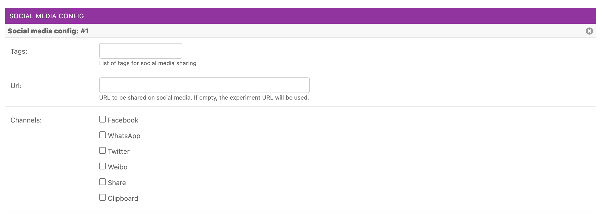

# Creating an experiment
Experiments come in different "flavours":
- an experiment with a single block: this is the most frequent type of experiment. A **block** is tied to a ruleset. Rulesets are defined through Python code (located in `backend.experiment.rules`).
- a *linear* experiment with multiple blocks, organized in one or more phases: a **phase** is a collection of blocks. The order of the blocks can be set to random. You could, for instance, have one phase with a block showing some introductory questions, then a phase with a number of randomized blocks (for instance, a just noticeable difference paradigm tied to different audio stimuli), and then a concluding phase with another block with a questionnaire.
- an experiment in **dashboard mode**, with a single phase and multiple blocks, in which participants can choose the order in which they step through different blocks.

## Admin interface
To create any type of experiment, open the admin interface and click "Add" next to "Experiments".

## The Experiment form
You will see an empty form:
. First of all, enter a short name in the `slug` field. This will be the link under which the experiment can be accessed. The `slug` can only contain alphanumeric characters and underscores. After that, press "Save and continue editing".

After that, you will see all options for the experiment:
.

### Field overview
The top fields in the experiment form allow you to enter various texts in different language. These will be shown to users when they participate in an experiment.
- Name of the experiment (only shown to participants in *dashboard mode*)
- Description of the experiment (only shown to participants in *dashboard mode*)
- Consent: a consent file to be shown to the user prior to the experiment (file upload)
- About content: background of the experiment (only shown to participants in *dashboard mode*)
- Social media message: message with which participants can post their results to social media. The placeholders `{points}` and `{experiment_name}` will be filled out automatically when a participant clicks the button. Note that not all social media platforms support setting the message from a share button; Facebook for instance doesn't allow this. See `Social Media Config` below for more sharing options.
- Disclaimer: a notice in the footer about who is behind the experiment (only shown to participants in *dashboard mode* if a `ThemeConfig` is linked)
- Privacy: privacy notice in the footer about treatment of the data (only shown to participants in *dashboard mode* if a `ThemeConfig` is linked)

You can switch between different languages by clicking on the tabs above the text fields, or switch all tabs simultaneously by selecting a language from the drop down menu at the top of the form. The available languages can be configured through the `LANGUAGES` setting in Django.

#### Theme Configuration (optional)
You can change the background, fonts and logos used for the experiment here. For detailed information on this, see the [Custom Theme](07_Custom_theme.md) documentation.

#### Active field
This field of the Experiment form is a checkbox indicating whether the experiment is active. This will always be checked by default. If you uncheck it, a request to `localhost:3000/{myslug}` will give you a blank screen stating `Experiment not found`. That way, you can close an experiment from further responses.

#### Phases
Phases (required): a phase of your experiment, which may contain one or more blocks. Note that every experiment needs to have at least one phase with one block configured.

Click "Add Phase" to show the phase form.

This will show the following fields:
- Index (default=0): will control the order of the phase in the experiment in case there are multiple phases.
- Dashboard (checkbox): If you check this box, the phase will appear in *dashboard mode*, from which users can select which block to play. If "dashboard" is unchecked, the blocks will be presented in linear order to the participant.
- Randomize (checkbox): If you check this box, the blocks will be shuffled, either in the dashboard view, or the linear procedure.
- Blocks: Within a phase, you have the option to add one or more **blocks**. Click "Add" under the header "Blocks" to add another block to the phase. This will open a pop-up with the block form.

#### Block form
- Index: order in which block should appear in the phase (default=0, will be ignored when the phase's `randomize` checkbox is checked)
- Slug: unique slug of the block

The following two fields have tabs above them to allow entering texts in different languages:

- Name: Name of the block (only shown in **dashboard mode**)
- Description: Description of the block (only shown in **dashboard mode**)

Other fields:

- Rules: the ruleset for the block
- Rounds (optional): how many rounds should be presented to the participant (*used in some, but not all rulesets!*)
- Bonus points (optional): bonus points to be awarded to the participant under given conditions (*used by very few rulesets*)
- Playlists (optional): select one or more playlists to be associated with the block (*note that some rulesets require a very specific format for the playlist, this will be checked when you save the experiment, and may generate warnings*)
- ThemeConfig (optional): You can change background, fonts and logos used for the block here, which will override the ThemeConfig of the experiment while this block is being played.

#### Block questions
Within each block, you also see a field with **Question Lists**. Question lists are created through the Question app, see the [next section](06_Custom_questions.md). The order of the question lists can be controlled through changing the index: lower numbers appear earlier in the block. Note that you need to have chosen block rules which show questions, such as the `Questionnaire` rules, in order for the question lists to appear.

#### Social Media Config (optional)
A Social Media Config can be used to customize the folowing information when participants share the experiment social media:

- Tags to be shared
- URL to be shared (by default, the URL of the experiment)
- Channels for which share buttons will be shown

Note that the *text* that will be used when participants share the experiment is configured on the top of the Experiment form.

